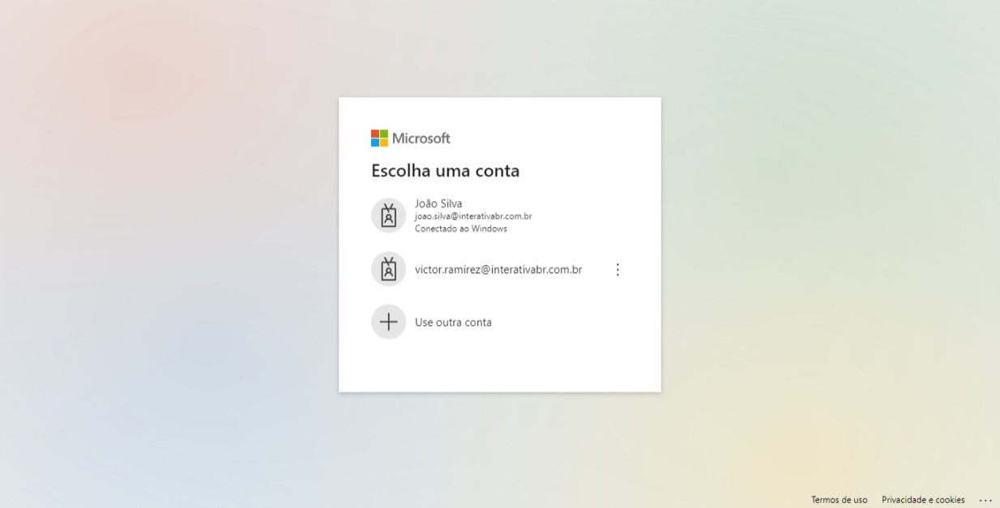

# MICROSOFT AUTHENTICATIONS SYSTEM

A aplicação integra-se com o sistema de autenticação da Microsoft Azure.

## Architecture

1.  **public**

- Contém páginas HTML e serve apenas para fins de depuração de redirecionamento.

2. **src**

- Contém toda a aplicação, dividida em módulos:
  1. app: Gerencia a lógica de negócios da aplicação.
     - **controllers**: Controladores da aplicação.
     - **errors**: Middleware de tratamento de erros HTTP personalizados.
     - **helpers**: Códigos reutilizáveis da aplicação.
     - **interfaceDTO**: Dados globais da aplicação.
     - **middlewares**: Middlewares de erro e middleware global de erro.
     - **repositories**: Responsável por conectar-se ao banco de dados (cache local).
     - **router**: Contém as rotas utilizadas.
     - **usecase**: Casos de uso, utilizados para conectar repositórios com controladores e retornar respostas ao servidor.
     - **app**: Configurações para o servidor.
  2. **config**: Contém todas as configurações do Passport.js.
  3. **database**: Realiza a conexão com o banco de dados.
  4. **services**: Contém as regras de negócios da aplicação.

3. **test**

OBS: TEST REMOVIDO, POR UM MOMENTO

- contem os teste execiaus da aplicação

**Observação**: Apenas a classe `CacheLocal` possui testes, pois o restante da aplicação é uma CLI de terceiros. Caso você faça alterações na `CacheLocal`, execute os testes para garantir que tudo esteja funcionando corretamente.

Para executar os testes, utilize o seguinte comando:

```bash
$ yarn test ou  npm run dev
```

## Como Executar o Projeto

Antes de iniciar o projeto, você deve definir variáveis de ambiente em um arquivo **.env**. No arquivo **.env.example**, estão listadas todas as variáveis necessárias:

- `PORT`: Porta que você deseja utilizar (por exemplo, 8000).
- `CLIENT_ID`: ID do cliente do portal Azure.
- `CLIENT_SECRET`: Chave secreta obtida no portal Azure.
- `CALLBACK_URL`: URL de mediação para sucesso e falha (deve ser a mesma que configurou no Azure e na rota).
- `SESSION_SECRET`: Segredo da sessão (pode ser o mesmo da CLIENT_SECRET, mas é recomendável alterá-lo periodicamente).
- `HASH_JWT`: Hash para criptografar dados e gerar chaves de hash assimétricas (use uma chave complexa).
- `URL_REDIRECT_SUCESS`: URL para onde o usuário logado deve ser redirecionado.
- `URL_REDIRECT_LOGOUT`: URL para onde o usuário deve ser redirecionado ao sair.

Após configurar as variáveis de ambiente, siga estas etapas para executar o projeto:

1. Instale as dependências do projeto:

   ```bash
   $ yarn ou npm i
   ```

2. Faça o build do projeto:

   ```bash
   $ yarn build ou npm run build
   ```

3. Inicie o projeto:

   ```bash
   $ yarn start ou npm start
   ```

4. Para iniciar o projeto em um ambiente de desenvolvimento:
   ```bash
   $ yarn dev ou npm run dev
   ```

## API da Aplicação

A API possui 6 rotas no total, sendo 4 delas dinâmicas (por padrao), ou seja, acessadas ao entrar em duas outras rotas.

- O template base de todas as rotas é este abaixo:

  - localhost:8000/v1/

    **OBS: caso tenha feito um upgrade na api e quera muda a verção do /v1/ para a desejada. basta que netre em /src/app/app.ts e altere o `use` da rota para a versão desejada. O `localhost` vai mudar de acordo com a hospedagem**

  - rotas:

    1. rota inicial:

       - **localhost:8000/v1/auth/microsoft**:
         essa rota vai mostra o login inicial, como mostra a imagem abaixo:
         

    2. rota de mediação:

       - **localhost:8000/v1/auth/microsoft/callback**:
       - Responsável por todo o sistema de autenticação da Microsoft, redirecionando para:

         2.1. **localhost:8000/v1/auth/microsoft/users**: Redireciona para a URL configurada em `URL_REDIRECT_SUCESS` em caso de login bem-sucedido, ex:

       - Digamos que tenho uma aplicação no front-end em que o usuário so vai poder acessar determinada rota estando autenticado. Quem vai fazer essa logica de autenticação, no lugar do front é o back-end. A sua url base **${Sua url base do front-end}** deve ser adicionada na variavel de ambiente `URL_REDIRECT_SUCESS`.

       - O **id** da **${Sua url base do front-end}** vai ser dinamico, sendo ele de acordo com o id do usuário na microsoft. Um exemplo de como ficaria a sua url no front-end: - **localhost:3000/user/auth/423583584657**

       Assim redirecinando o usuário para a rota privada.

       2.2. **auth/microsoft/failure**: Acionada em caso de falha durante o login. Ex:

       - Quando voçê tenta acessa a rota **localhost:8000/v1/auth/microsoft/users** sem antes passa pea rota **localhost:8000/v1/auth/microsoft**

    3. **localhost:8000/v1/users/:id**: Responsável por obter o token de autenticação do usuário.

    4. **localhost:8000/v1/logout**: Desloga o usuário.
